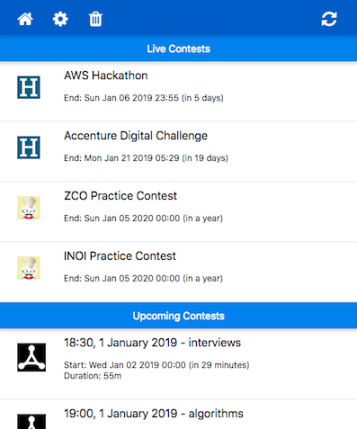
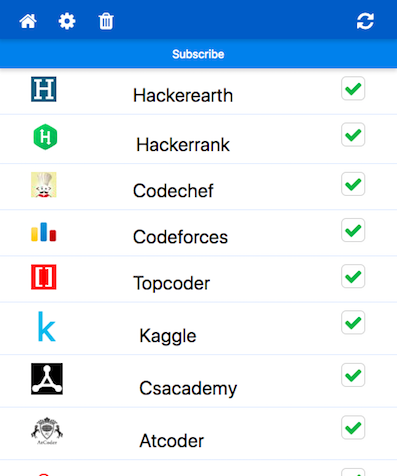

# Coder's Calendar
  
   
  
Browser extensions for competitive programming enthusiasts.
Shows a list of live & upcoming coding contests taking place in various popular competitive programming websites with the facility to add them to your google calender.
Currently shows updates from Codechef , HackerEarth , Hackerrank, Topcoder and Codeforces.  
  
## Download  
Coder's Calendar is  available for download at:
- [Chrome Extension](https://chrome.google.com/webstore/detail/coders-calendar/bageaffklfkikjigoclfgengklfnidll). 
  
### FIREFOX 
If you're a Firefox user, you can download Coder Calendar's latest Firefox release zip file from [here](https://github.com/nishanthvijayan/CoderCalendar-Extensions/releases/latest). To install it, following these instuctions:
  

 1. Open `about:debugging` in a new tab
 2. Select `Load Temporary Add-on` option
 3. Select any file from the extracted release zip file you downloaded
  
     
## Building locally
To install the dependencies, run
``` 
npm install 
```
from inside this directory.  
  
To run the extension, first run
```
npm run build
```
This will compile the react code inside `app/` to `build/chrome` & `build/firefox` respectievely.

### Installing in Chrome
 1. Open `chrome://extensions` in a new tab
 2. Select `Load unpacked extensions`
 3. Load the `build/chrome` folder


### Installing in Firefox
 1. Open `about:debugging` in a new tab
 2. Select `Load Temporary Add-on` option
 3. Select any file from the `build/firefox` folder

## To-Do
 - [ ] Test Suite for the components
